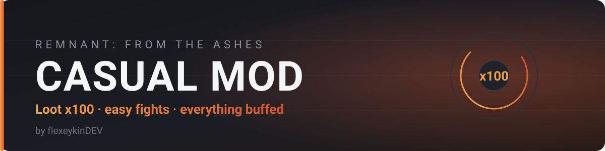
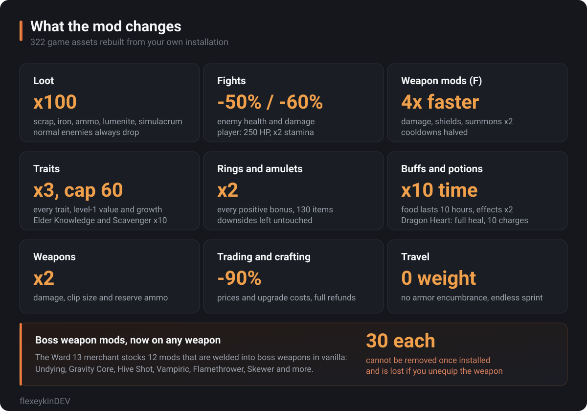

A relaxed-mode overhaul for **Remnant: From the Ashes**. Loot x100, weak enemies, buffed traits, rings, weapon mods and potions — built for people who want the game's worlds and bosses without the grind.

## Install

1. Download `CasualMod_P.pak` from [Releases](../../releases) (or `dist/CasualMod_P.pak` in this repo).
2. Drop it into `...\steamapps\common\Remnant\Remnant\Content\Paks`.
3. Start the game.

**Uninstall:** delete the file. Nothing else in the game folder is touched, and saves keep working.

Singleplayer or hosting only — a client without the mod will not see your values.

## What it changes



| | Vanilla | Casual Mod |
|---|---|---|
| Scrap from a soldier | 10–25 | 1000–2500 |
| Lumenite / simulacrum per drop | 1–8 | 100 |
| Enemy health / damage | 100% | 50% / 40% |
| Player health | 100 | 250 |
| Weapon damage, clip, reserve | 100% | 200% |
| Weapon mod charge | 500 power | 125 power |
| Trait growth, max level | 100%, 20 | 300%, 60 |
| Ring and amulet bonuses | 100% | 200% |
| Food buff | 1 hour | 10 hours |
| Adrenaline | 30 s | 5 min |
| Dragon Heart | 100 HP, 3 charges | ~1000 HP, 10 charges |
| Prices and upgrade costs | 100% | 10% |
| Armor weight | up to 46 | 0 |

Sagestone gives +500% XP, Scavenger's Bauble +500% scrap, and normal enemies always drop loot.

### Boss weapon mods for sale

The Ward 13 merchant now stocks 12 of the mods that are welded into boss weapons in vanilla — Undying,
Hive Shot, Gravity Core, Flamethrower and the rest — so you can put them on any weapon you like.

Read this before you buy: the game still treats them as built-in. **A boss mod cannot be taken off
again, and it is destroyed when you unequip that weapon**, so the shop sells three of each. This is a
workaround, not a real slot: the game has no item for these mods, a shop entry is simply pointed at
the mod asset. The merchant sells them for scrap instead of boss materials, and the entries replace
the iron, lumenite and simulacrum he used to sell — all of which now drop x100 in the world anyway.

<details>
<summary><b>For developers — build it yourself</b></summary>

### Build

Needs Python 3.10+, Windows and an installed copy of the game. Nothing else — no engine, no SDK.

```bash
python build.py
```

The build unpacks the ~2800 assets it touches from your game paks, applies the rules, checks every result against the vanilla file and writes `dist/CasualMod_P.pak`.

```bash
python build.py --verbose   # print every single value change
python build.py --refresh   # unpack the game assets again
python build.py --game "D:\Games\Remnant"   # if Steam auto-detection fails
```

### Tune it

Every number lives in [`config.py`](config.py): `RESOURCE_MULTIPLIER`, `DIFFICULTY`, `TRAIT_GROWTH_MULTIPLIER`, `MOD_POWER_COST_MULTIPLIER`, and so on. Change one, run `build.py`, done.

### Layout

```
build.py             one-command build: unpack -> edit -> verify -> pack
config.py            all tunable values
inspect_assets.py    dev CLI: dump an asset, a DataTable, or all numeric fields of a folder
tools/pak.py         pak reading (v3-v8) and writing (v3)
tools/uasset.py      cooked UE 4.22 package reader
tools/edit.py        property editing, name-map growth, offset fixups
tools/rules.py       what the mod actually changes
tools/validate.py    post-edit verification
build/vanilla        unpacked game assets (git-ignored)
build/modded         edited assets that go into the pak (git-ignored)
```

### How it works

The game runs Unreal Engine 4.22 and stores its values as tagged properties inside cooked packages:
`.uasset` (header, name map, import/export tables) plus `.uexp` (object data). The tools parse those,
change values in place, and — when a property does not exist at all, such as `Chance` on a loot entry —
insert a new property tag, append the missing names to the name map with the engine's own FName hashes,
and shift every affected header offset, export size and export offset.

Two things about this game in particular:

* **Mods must be pak v3.** Remnant's own paks are v8, and `UnrealPak` from later engine versions writes
  v11, which 4.22 will not mount. `tools/pak.py` writes v3 uncompressed.
* **`pakchunk1` mounts at `Remnant/Content/`**, not at the engine root like `pakchunk0`, so entry paths
  have to be prefixed with the pak's own mount point.

### Verification

`tools/validate.py` runs on every build before packing. For each edited asset it re-parses the result and
compares it to the vanilla original: header offsets and sizes, exports contiguous and ending at the package
tag, name map and export list unchanged, no property lost, and only `Chance` / `QuantityMin` / `QuantityMax`
added. A round-trip test (load and save with no edits) reproduces all 2800+ vanilla assets byte for byte.

None of this is a substitute for playing the game — behaviour that lives in blueprint bytecode cannot be
checked from the files alone.

</details>

## Credits

Made by **flexeykinDEV**. The pak is built from your own game installation; no game content is redistributed by this repository.
